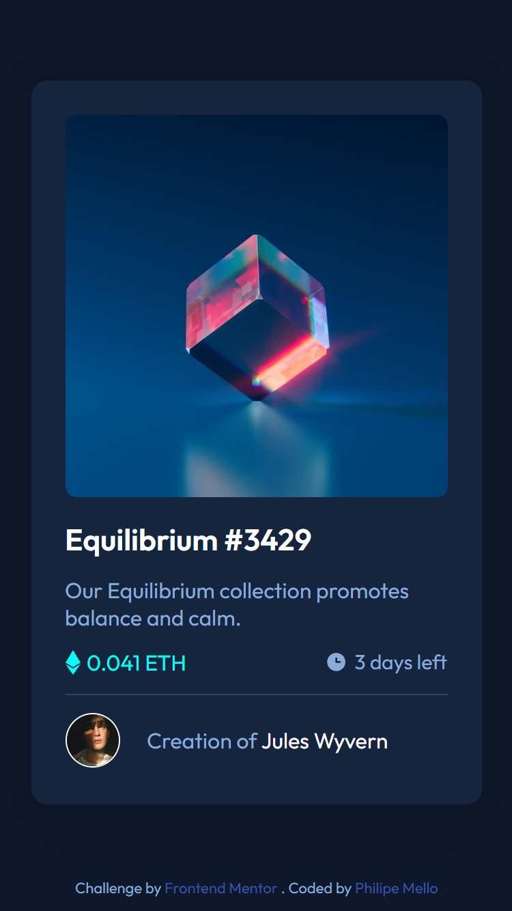
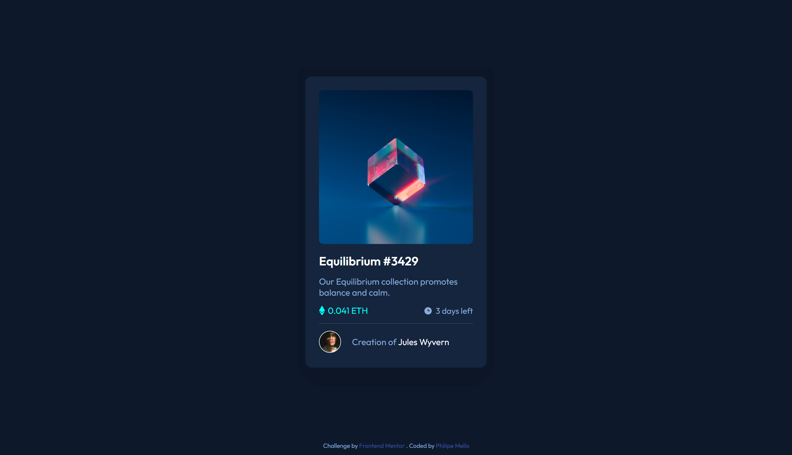
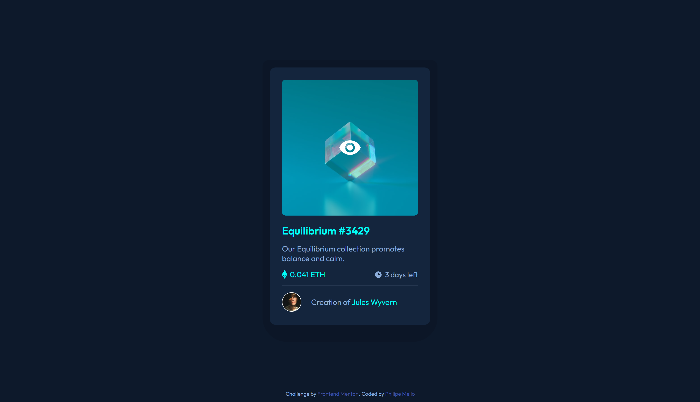

# Frontend Mentor - NFT preview card component solution

This is a solution to the [NFT preview card component challenge on Frontend Mentor](https://www.frontendmentor.io/challenges/nft-preview-card-component-SbdUL_w0U). Frontend Mentor challenges help you improve your coding skills by building realistic projects. 

## Overview

### The challenge

Users should be able to:

- View the optimal layout depending on their device's screen size
- See hover states for interactive elements

### Screenshot

 - Mobile

 - Desktop

 - Active states

### Links

- Solution URL: [GitHub](https://github.com/Philipessj1/NFT-preview-card)
- Live Site URL: [GitHub Pages](https://philipessj1.github.io/NFT-preview-card/)

## My process

### Built with

- Semantic HTML5 markup
- CSS custom properties
- Flexbox
- CSS Grid
- CSS FlexBox
- CSS variables
- Mobile-first workflow

## Author

- GitHub - [Philipe Mello](https://github.com/Philipessj1)
- Frontend Mentor - [@philipessj1](https://www.frontendmentor.io/profile/Philipessj1)
